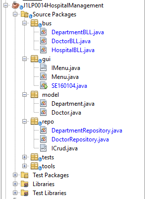

# Hospital Management - Version 1.0

1. Introduction:
    - App name: **Hospital Management**
    - Version: **1.0**
    - Type: **Console application**
    - Describe: **Manage the information of departments and doctors in the hospital.**
2. Functions:
    - **Add** a new doctor/department
    - **View all** information on the doctor/department list.
    - **Search** doctor/department in hospital by ID/Name.
    - **Update** a doctor/department
    - **Delete** information of a doctor/department.
    - **Store data to file.**
3. Data Format
- Department(
    - **ID**: DEPxx (x is a digit in 0..9)
    - **name**: String
    - createDate: Date
    - lastUpdateDate: Date
    
    )
    
- Doctor(
    - **ID**: DOCxxx (x is a digit in 0..9)
    - **name**: String
    - **sex**: true/false ~ male/female
    - **address**: String
    - **departmentID**
    - createDate: Date
    - lastUpdateDate: Date
    
    )
    
4. Project Design: **Repository pattern**

